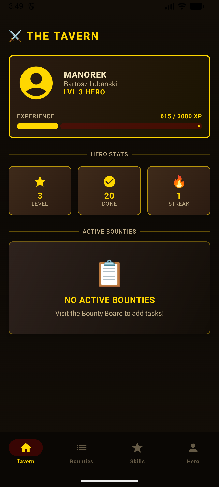
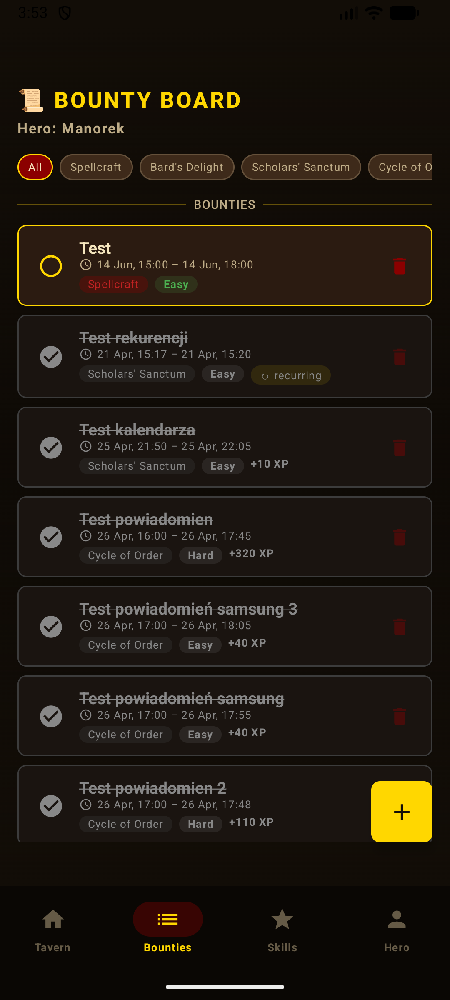
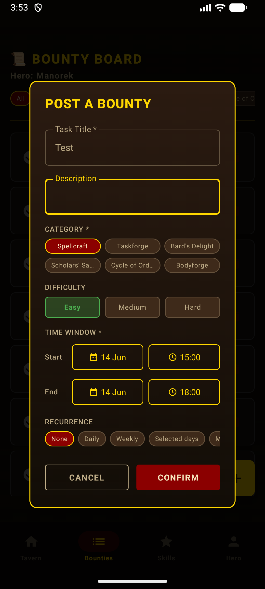
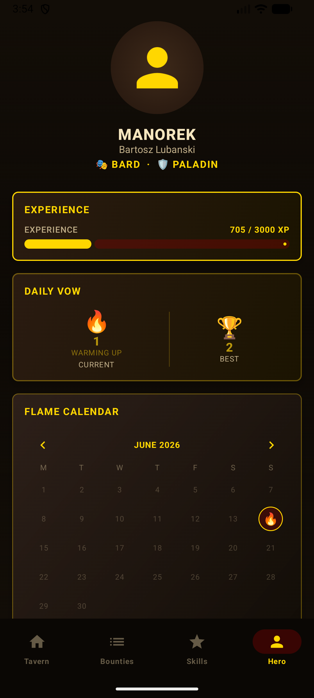
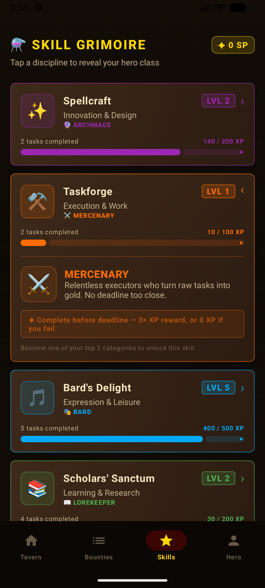
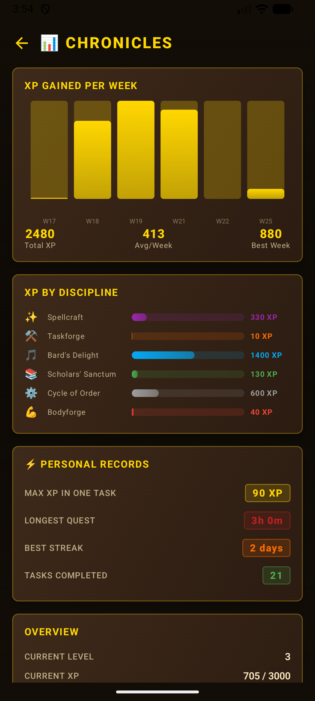

# Progressify

A mobile productivity application that gamifies everyday task management using RPG mechanics. Complete tasks, earn XP, level up your hero, and build daily streaks — turn your goals into an adventure.

---

## 📸 Screenshots

| Dashboard (Tavern) | Task List | Add Task |
|:---------:|:-----:|:------:|
|  |  |  |
| *Main screen — first impression* | *Core feature — where users spend most time* | *Recurrence, categories and difficulty options* |

| Hero Class | Skills | Statistics |
|:---------:|:-----:|:----------:|
|  |  |  |
| *RPG class selection with unique XP multipliers* | *Skill progression and categorization* | *Long-term usage value* |

---

## Features

- **Task Management** — Create, edit, complete, and delete tasks with categories and recurrence options (daily, weekly, monthly, yearly, or custom days)
- **XP & Leveling System** — Earn experience points based on task difficulty and completion timing; level up your hero
- **Hero Classes** — Choose from 6 RPG-style classes, each with unique XP multipliers:
  - Archmage (Spellcraft bonus)
  - Mercenary (Taskforge bonus)
  - Bard (Bard's Delight bonus)
  - Lorekeeper (Scholar's Sanctum bonus)
  - Paladin (Cycle of Order bonus)
  - Barbarian (Bodyforge bonus)
- **Skill Categories** — Track progress across 6 skill categories aligned with hero classes
- **Streak Tracking** — Maintain daily completion streaks for bonus XP
- **Statistics** — View XP per week, task completion rates, and skill growth charts
- **Notifications** — Task reminders via scheduled alarms

---

## Tech Stack

| Layer | Technology |
|-------|------------|
| Language | Kotlin |
| UI | Jetpack Compose + Material 3 |
| Navigation | Navigation Compose |
| Architecture | MVVM + Repository pattern |
| Database | Firebase Firestore |
| Auth | Firebase Authentication |
| Build | Gradle (Kotlin DSL) |

---

## Architecture

```
com.example.progressify/
├── screens/            # Compose screens (Dashboard, Tasks, Skills, Profile, Stats, Auth)
├── viewmodel/          # AuthViewModel, TaskViewModel
├── UserRepository.kt   # Firestore data access layer
├── Task.kt             # Task model + XP calculation & recurrence logic
├── User.kt             # User data model
├── Components.kt       # Reusable UI components
└── NotificationScheduler.kt
```

### Firestore Structure

```
users/{uid}
  └── categories/{categoryName}
      ├── active/{taskId}
      ├── completed/{taskId}
      └── deleted/{taskId}
```

---

## Requirements

- Android SDK 28+
- Target SDK 36
- Android Studio (latest stable)
- Firebase project with Firestore & Authentication enabled

---

## Getting Started

1. Clone the repository
2. Open in Android Studio
3. Add your `google-services.json` to the `app/` directory
4. Enable Email/Password authentication in the Firebase console
5. Build and run on a device or emulator (API 28+)

---

## Team

| Role | Name | GitHub |
|------|------|--------|
| Frontend | Bartosz Lubański | [@BartoszLubanski](https://github.com/BartoszLubanski) |
| Backend | Adrian Oryński | [@AdrianOrynski](https://github.com/AdrianOrynski) |

Developed as a university course project — Mobile Application Project, 3rd year Applied Computer Science & Measurement Systems, University of Wrocław.
